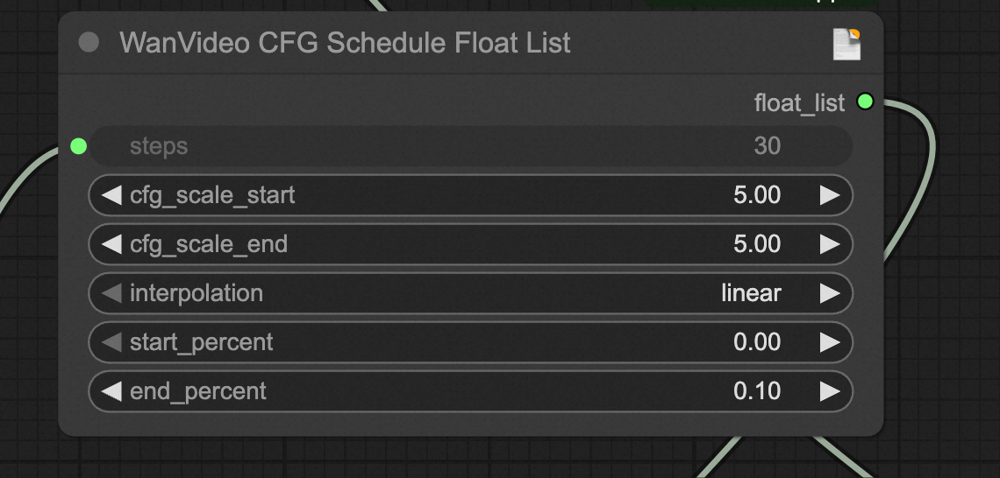

[中文](./tips_zh.md)

# FantasyTalking User Guide

Based on extensive feedback from users and researchers, we have identified several differences between the **Community Edition: FantasyTalking ComfyUI workflow** and the **official implementation** that may degrade the user experience:  

1. **Inaccurate Lip-Sync**
   - See [Issue #54](https://github.com/Fantasy-AMAP/fantasy-talking/issues/54#issuecomment-2890198393).  
   - **Cause Analysis:** ComfyUI introduces an **Audio CFG Scheduling** mechanism that applies audio conditioning only during the first 10% of denoising steps. By contrast, the official implementation applies Audio CFG throughout **all** denoising steps, ensuring precise audio-video alignment.  
   - **Recommendation:** In the **Audio CFG Schedule** node, set `end_percent` to **0.7 or higher** (the paper uses 1.0). This extends the range of denoising steps influenced by audio conditioning and markedly improves lip-sync quality.

2. **First-Frame Color Shift and Blur**
   - See [Issue #194](https://github.com/kijai/ComfyUI-WanVideoWrapper/issues/194).  
   - This is a common artifact in current video diffusion / synthesis models: the first frame may suffer from color drift or loss of focus. Targeted post-processing or model configuration tweaks are usually required.

3. **Limited Control and Consistency in Long-Form Video Generation**
   - Long sequences often exhibit motion drift or detail inconsistency. Mitigation strategies include segmented generation, key-frame locking and cyclic consistency constraints.

## Quick Configuration

- **Key Parameters**  
  - `end_percent` (Audio CFG Schedule): proportion of denoising steps with audio conditioning. Official recommendation: **≥ 0.7**.  
  - Other critical hyper-parameters (sampling steps, resolution, CFG scale, etc.) follow standard video diffusion practice; adjust according to the official docs/examples.

- **Common Troubleshooting**  
  - **Lip-sync issues →** Verify that Audio CFG Schedule is enabled and `end_percent` is set correctly.  
  - **Blurred first frame →** Add “Frame Interpolation” or “Deblur” post-processing nodes, or reduce the initial noise strength.  
  - **Long-form drift →** Generate in segments with key-frame interpolation, or use the official long-video consistency script.

- **Recommended Defaults**  
  - `end_percent` ≥ 0.7 (strongly recommended)  
  - Sampling steps ≥ 30; output resolution = target resolution  
  - Tune `CFG scale` (typically **3.0 – 7.0**) to balance fidelity and creativity

Following these guidelines should bring the Community Edition ComfyUI workflow much closer to the official implementation in terms of lip-sync accuracy and visual quality. If further assistance is needed, please comment under the relevant issue or contact us directly.

---

## Detailed Guide for the Community FantasyTalking ComfyUI Workflow

### 1. Recommended Settings
- **ComfyUI Workflow**  
  - In the FantasyTalking ComfyUI workflow, set `end_percent` in the **Audio CFG Schedule** node to **≥ 0.7**.  
    - This parameter defines the fraction of denoising steps receiving audio conditioning. The original workflow default is 0.1, which allows too few steps for FantasyTalking to influence lip-sync adequately.

- **Personalization**  
  - You can control character motion, behavior and emotion via prompts, and adjust the influence of prompts and audio using `prompt_cfg_scale` and `audio_cfg_scale` (both exposed in ComfyUI).  
  - For stronger lip-sync, increase `audio_cfg_scale`. A typical range for both scales is **3.0 – 7.0**.

### 2. Key Node Parameters in the FantasyTalking Workflow
**WanVideo CFG Schedule Float List**

- `cfg_scale_start`, `cfg_scale_end`, `interpolation`: define the scaling range of the audio CFG.  
- `start_percent`, `end_percent`: delimit the denoising interval where audio CFG is applied.

The node outputs a float list assigning an audio CFG value to each denoising step; steps outside the specified range default to 1.0.

### 3. Common Issues & Solutions

#### 3.1 Lip-Sync Inaccuracy
The community workflow applies `audio_cfg = 5` only during the first 10 % of denoising steps, limiting FantasyTalking’s influence and causing misalignment. The official implementation applies `audio_cfg = 4.5` across **all** steps.

**🔥 Solution:** Increase `end_percent` so that audio CFG spans more denoising steps—this greatly improves lip-sync.

#### 3.2 First-Frame Color Shift and Blur
Because FantasyTalking is trained on an I2V-based video generation model, first-frame artifacts (color shift, blur) inherit from the base model. FantasyTalking’s audio conditioning can further amplify the issue (see [Issue #194](https://github.com/kijai/ComfyUI-WanVideoWrapper/issues/194)).

**🔥 Solution:** Lower FantasyTalking’s influence by reducing the number of denoising steps affected (`end_percent = 0.7`) or lowering `audio_cfg_scale`. This biases generation toward the base model’s first-frame reference, at the cost of some lip-sync precision.

**Experimental Comparison**

Adjusting `end_percent` in the **Audio CFG Schedule** node yields markedly different results:

<table>
  <tr>
    <th>end_percent</th>
    <th>Generated Video</th>
    <th>Effect Description</th>
  </tr>
  <tr>
    <td>0.1</td>
    <td>
      <video style="width: 220px; height: auto;" src="https://github.com/user-attachments/assets/e5dbd0b9-7c18-4627-aa16-881e513d16a4" type="video/mp4">
        Your browser does not support the video tag.
      </video>
    </td>
    <td>The lip-sync is not very good.</td>
      </tr>
  <tr>
    <td>0.4</td>
    <td>
      <video style="width: 220px; height: auto;" src="https://github.com/user-attachments/assets/e80c328b-d1d2-43f9-bad8-665ac78dfb40" type="video/mp4">
        Your browser does not support the video tag.
      </video>
    </td>
    <td>The lip-sync is quite good.</td>
  </tr>
  <tr>
    <td>0.7</td>
    <td>
      <video style="width: 220px; height: auto;" src="https://github.com/user-attachments/assets/c44a8499-93d2-4038-b72e-9174b5652aa0" type="video/mp4">
        Your browser does not support the video tag.
      </video>
    </td>
    <td>The lip-sync is very good.</td>
  </tr>
  <tr>
    <td>1.0</td>
    <td>
      <video style="width: 220px; height: auto;" src="https://github.com/user-attachments/assets/0f100d85-1b78-4ea1-958a-7634fcce5888" type="video/mp4">
        Your browser does not support the video tag.
      </video>
    </td>
    <td>The first frame may be blurry and have color deviations.</td>
  </tr>
</table>

#### 3.3 Audio-Driven Long-Form Video Generation
**Wan 2.1** still faces accuracy and consistency challenges for long clips (see [Issue #87](https://github.com/kijai/ComfyUI-WanVideoWrapper/issues/87) and [Issue #166](https://github.com/kijai/ComfyUI-WanVideoWrapper/issues/166)). Current workarounds include

- Concatenating head/tail clips  
- Sliding-window generation

We recommend the **sliding-window** approach: denoise in overlapping chunks and fuse latent features in the overlap region. See kijai’s [long-video generation workflow](https://github.com/kijai/ComfyUI-WanVideoWrapper/blob/main/example_workflows/wanvideo_long_T2V_example_01.json) for an implementation.
